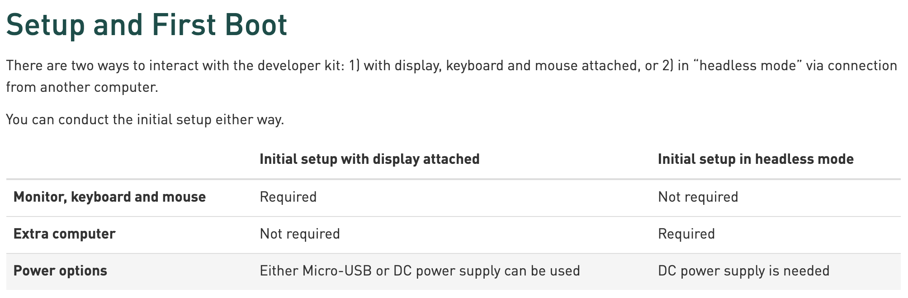

# Workshop Advantech Jetson Nano

This tutorial has been designed for the [PERFECTING FACTORY 5.0 WITH EDGE-POWERED AI](https://www.sparkfun.com/perfecting_factory_5_with_edge) workshop in collaboration with Advantech and Sparkfun.

**Tools and Softwares:**

- [Edge Impulse Studio](https://studio.edgeimpulse.com) 
- [Edge Impulse CLI](https://docs.edgeimpulse.com/docs/cli-installation) (optional)
- [Balena Etcher](https://www.balena.io/etcher) to flash the SD card
- [Python 3](https://www.python.org/downloads/) to extract frames from a video

**Hardware:**

-  Nvidia [Jetson Nano](https://www.sparkfun.com/products/17244) or Advantech [AIR-020](https://www.advantech.com/products/65f20c25-f6ef-4ab5-be3c-b7dfa7a833b3/air-020/mod_fcf216c8-3495-4809-b815-61dc008d53a4)

- An SD Card (recommended 32 GB UHS-1 card according to Nvidia)
- An ethernet cable (the Jetson Nano doesn't have Wifi)
- An external camera (optional)
- Depending on how you want to setup your Jetson Nano you'll need either a monitor, keyboard and mouse or a DC power supply:

*Screenshot from [Getting Started with Jetson Nano Developer Kit](https://developer.nvidia.com/embedded/learn/get-started-jetson-nano-devkit#setup)*

For this workshop I will use the second option to ease the sharing screen option during the screencast.

## Overview 

- [Installing the dependencies](#installing-the-dependencies)
- [Prepare your dataset](#prepare-your-dataset)
- [Train your Machine Learning Model](#train-your-machine-learning-model)
- [Run your inference on the target](#run-your-inference-on-the-target)

## Installing the dependencies

Make sure to follow this documentation page to setup your Jetson Nano with Edge Impulse: [https://docs.edgeimpulse.com/docs/nvidia-jetson-nano](https://docs.edgeimpulse.com/docs/nvidia-jetson-nano)

## Prepare your dataset

## Train your Machine Learning Model

## Run your inference on the target
