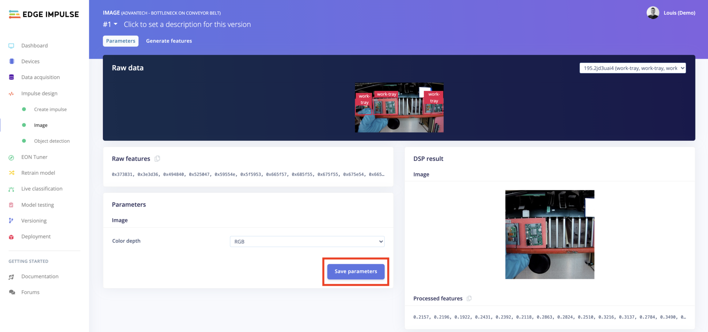
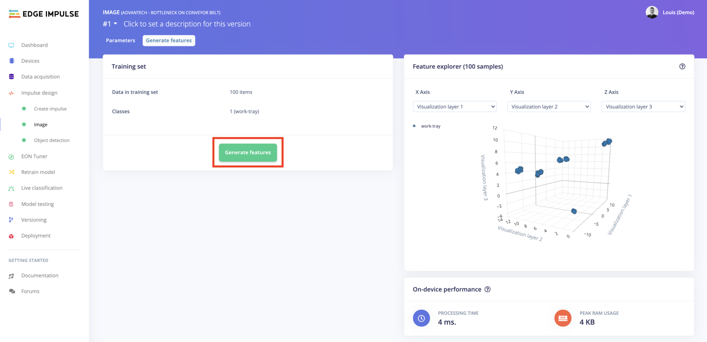
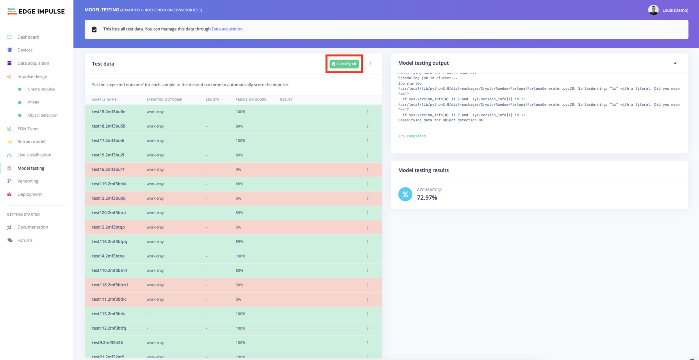
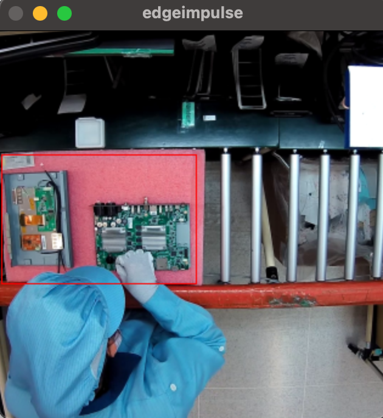
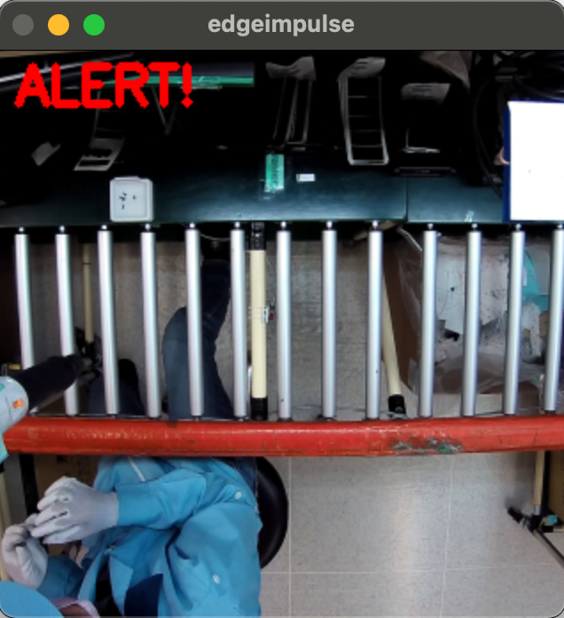

# Workshop Advantech Jetson Nano

This tutorial has been designed for the [PERFECTING FACTORY 5.0 WITH EDGE-POWERED AI](https://www.sparkfun.com/perfecting_factory_5_with_edge) workshop in collaboration with Advantech and Sparkfun.

## Overview


**Context**

Edge Impulse has been provided two videos by Advantech. **Both videos are real cases for a production line and an operation station in a factory respectively.**:

- Production line:


- Operation station: 


**Objectives:**

Advantech wants to provide an efficient way to manage operation time and productivity calculation in manufacturing assembly. At the current state, there is an administrator looking around to make sure normal productivity:

- **Use case 1:**
For the first use case, the goal is to improve productivity and make human resources more effective through this AI solution for smart factory management.
Administrators can be informed immediately once productivity has something wrong (bottleneck, operator not present, etc...) even though administrators are not at the scene.


- **Use case 2:**
For the second use case, the video shows a limited-access operation where it is accessible only for specific staff to keep production quality and operational safety.
The allowable staff would be dressed in specified a hat and vest.
With such an AI solution, administrators can be informed immediately once unusual personnel would like to manipulate crucial equipment.


**Tools and Softwares:**

- [Edge Impulse Studio](https://studio.edgeimpulse.com) 
- [Edge Impulse CLI](https://docs.edgeimpulse.com/docs/cli-installation) (optional)
- [Balena Etcher](https://www.balena.io/etcher) to flash the SD card
- [Python 3](https://www.python.org/downloads/) to extract frames from a video

**Hardware:**


- [Advantech AIR-020](https://www.advantech.com/products/65f20c25-f6ef-4ab5-be3c-b7dfa7a833b3/air-020/mod_fcf216c8-3495-4809-b815-61dc008d53a4) or
[NVIDIA Jetson Nano 2GB Developer Kit](https://www.sparkfun.com/products/17244) or [NVIDIA Jetson Nano Developer Kit](https://www.sparkfun.com/products/16271)


- An SD Card (recommended 32 GB UHS-1 card according to Nvidia)
- An ethernet cable
- An external camera (optional)
- Depending on how you want to setup your Jetson Nano you'll need either:
	- an extra computer to communicate with the Jetson Nano directly from the host computer 
	- or a monitor, keyboard and mouse to interact directly with the Jetson Nano.

Please see [Getting Started with Jetson Nano 2GB Developer Kit](https://developer.nvidia.com/embedded/learn/get-started-jetson-nano-2gb-devkit#setup) for more indications.

For this workshop I will use the first option to ease the screen sharing during the screencast.


## Agenda 

- [Introduction](#overview)
- [Installing the dependencies](#installing-the-dependencies)
- [Prepare your dataset](#prepare-your-dataset)
- [Train your Machine Learning Model](#train-your-machine-learning-model)
- [Run your inference on the target](#run-your-inference-on-the-target)

## Installing the dependencies

Although this step should have been done before the workshop, we'll go through it quickly.

*Note that this step can take up to one hour depending on your internet speed.*

Make sure to follow this documentation page to setup your Jetson Nano with Edge Impulse:

[https://docs.edgeimpulse.com/docs/nvidia-jetson-nano](https://docs.edgeimpulse.com/docs/nvidia-jetson-nano)


On the documentation page, go to the `Setting up your Jetson Nano` section and click on the NVIDIA's setup instructions link according to which Jetson Nano you have. You will arrive on Nvidia's getting started page and then download the `Jetson Nano Developer Kit SD Card Image` (about 6.1 GB). Once downloaded, open [Balena Etcher](https://www.balena.io/etcher) to flash the SD card (about 10 to 15 min):


Insert your SD card, connect the ethernet cable, connect the Micro-USB port to your computer and connect the USB-C power source:


On your primary computer, open a serial console (`PuTTY` on Windows or `screen` on MacOS and Linux), see the full instruction [here](https://developer.nvidia.com/embedded/learn/get-started-jetson-nano-2gb-devkit#setup).

Example on MacOS:

```
sudo screen /dev/cu.usbmodem14241201137883 115200
```

Follow the command prompt and once finished, you will be able to log in your Jetson Nano 2GB Developer Kit:


All you need to do now is to make sure your device is connected to the internet and run the following command to install Edge Impulse Linux CLI:

```
wget -q -O - https://cdn.edgeimpulse.com/firmware/linux/jetson.sh | bash
```


## Prepare your dataset

In most of machine learning projects, collecting data and preparing your dataset is a long and repetitive task. During this workshop, you will be taught how to use a video as the datasource, how to extract sequences of the video (optional but convenient) and finally how to extract frames from the video sequences.

*Edge Impulse core engineering team is currently working on adding video support directly from the studio to ease this process but as of December 2021 it is not yet publicly available.*

To obtain an extract of one of the dataset we will be seeing together, download it from here: [dataset](https://edgeimpulse-public.s3.fr-par.scw.cloud/Advantech-Workshop/Advantech-Workshop/Advantech-Workshop/Advantech-Workshop/Advantech-Workshop/dataset.mp4)


### Extract frames from a video source

I created two python script to help you do that. They can be found under this Github repository. 

*The following actions has been tested on the Jetson Nano 2GB Developer Kit. It should also work on your laptop as long as you have python3 installed properly, Edge Impulse CLI installed (you need Node v14 or higher installed) and a few python packages. All the needed dependencies are already installed on the Jetson Nano.*

First clone this repository:

```
git clone https://github.com/edgeimpulse/workshop-advantech-jetson-nano.git
```

The structure looks like that:

```
├── LICENSE
├── README.md
├── assets
├── code_samples
│   ├── extract_frames
│   │   └── extract_frames.py
│   └── split_video
│       ├── split.py
│       └── times.txt
│   └── inference
│       ├── classify-images.py
│       └── classify-video.py
│       └── device_patches.py
└── dataset
```

Navigate to the `dataset/` repository and get the video source:

```
cd dataset/
```
```
wget https://edgeimpulse-public.s3.fr-par.scw.cloud/Advantech-Workshop/Advantech-Workshop/Advantech-Workshop/Advantech-Workshop/Advantech-Workshop/dataset.mp4
```

We won't be focusing on the split_video script during this workshop but it is present because it can help you to extract a video sequence an exact event if needed.

Now, navigate to the `extract_frames` repository:

```
cd ../code_samples/extract_frames
```

and run the following command to execute the script:

```
python3 extract_frames.py --input ../../dataset/dataset.mp4 --output output --frameRate 1 
```

*Explanation: The script takes as an input the video dataset, stores in an output folder each frame, taken once every second*

Here is the full script if you want to have a look:

```
import argparse
import cv2
import os

def extractImages(input, output, frameRate):
    if not os.path.exists(output):
        os.makedirs(output)

    count=1
    vidcap = cv2.VideoCapture(input)

    def getFrame(sec):
        vidcap.set(cv2.CAP_PROP_POS_MSEC,sec*1000)
        hasFrames,image = vidcap.read()
        if hasFrames:
            cv2.imwrite(output+"/"+str(count)+".jpg", image) # Save frame as JPG file
        return hasFrames

    sec = 0
    frameRate = int(frameRate) # Change this number to 1 for each 1 second, 0.5 for 500ms etc...
    # frameRate = 0.5 # Use this line if you want to take 2 images per second
        
    success = getFrame(sec)
    while success:
        print ('Read a new frame: ', success, '; at ', sec, 's ; frame number: ', count)
        count = count + 1
        sec = sec + frameRate
        sec = round(sec, 2)
        success = getFrame(sec)
        

if __name__=="__main__":
    print("Extracting Frames from video")
    a = argparse.ArgumentParser()
    a.add_argument("--input", help="path to video input")
    a.add_argument("--output", help="path to images")
    a.add_argument("--frameRate", help="frame rates, set 1 for 1 image per second, 2 for 1 images every 2 seconds, etc...")
    args = a.parse_args()
    print(args)
    extractImages(args.input, args.output, args.frameRate)

# example: python3 extract_frames.py --input ../../dataset/dataset.mp4 --output output --frameRate 2 
```

Now that we have our individual frames, it is time to go to Edge Impulse Studio and create a project. If you do not have an Edge Impulse account yet, start by creating an account on [Edge Impulse Studio](https://studio.edgeimpulse.com) and create a project by selecting an `Image` project and an `Object Detection` model:


Go to the `Data Acquisition` view while we will upload the frames.

Back on your Jetson Nano, make sure you are still under the `code-samples/extract_frames/` folder and run the following command:

```
edge-impulse-uploader output/* 
```

You should see the following output:

```
Edge Impulse uploader v1.14.0
? What is your user name or e-mail address (edgeimpulse.com)? louis-demo
? What is your password? [hidden]
Endpoints:
    API:         https://studio.edgeimpulse.com/v1
    Ingestion:   https://ingestion.edgeimpulse.com

Upload configuration:
    Label:       Not set, will be infered from file name
    Category:    training

? To which project do you want to upload the data? Louis (Demo) / Workshop Advan
tech Sparkfun
[  1/180] Uploading output/101.jpg OK (1929 ms)
[  2/180] Uploading output/109.jpg OK (1945 ms)
[  3/180] Uploading output/116.jpg OK (2551 ms)
...
[179/180] Uploading output/90.jpg OK (2706 ms)
[180/180] Uploading output/93.jpg OK (2335 ms)

Done. Files uploaded successful: 180. Files that failed to upload: 0.
```


*Hint: If you have an external camera connected to your Jetson Nano, you can use the following command to connect your Jetson Nano to the studio and collect images directly from your Jetson Nano:*
 
```
edge-impulse-linux
```


Some users reported a permission issue leading to the `Failed to start device monitor!` issue. 
To bypass it do:

```
$> whoami
your-username

$> chown -R your-username:your-username ~/.config
```


### Create bounding boxes on your images

We are all set to start creating our bounding boxes around what we want to detect. This is not the fun part!

Go to the `Labelling queue (180)` under the `Data acquisition` view:


And start drawing the bounding boxes around what you want to detect.

As an example, here if we want to avoid bottlenecks on the production line, we can detect **if the working tray is present** and **check attendance by detecting the chair** (we could also check attendance directly by detection if the person is present). If no working tray is present it means that there was an issue before on the production line and if we can detect the chair, then the operator is not present. These are just examples of what you can detect in a constrain environment such as this one:


Label all your frames and `Perform a train / test split` under the `Dashboard` view to put away some samples during the training. We will use this dataset to validate our model later:


Then navigate to the next view: `Create Impulse`.
And because, it is long and boring to do, here is the public project Edge Impulse created for you:

[https://studio.edgeimpulse.com/public/54925/latest](https://studio.edgeimpulse.com/public/54925/latest)

Feel free to clone this project to your account and start exploring!


## Train your Machine Learning Model

The following screenshots should be self-explanatory, feel free to watch the live stream or the replay for more details:

### Create Impulse


### Generate Features

Generating features is an important step in Embedded Machine Learning. It will create features that are meaningful for the Neural Network to learn on instead of learning directly on the raw data. If you are familiar with Computer Vision, you can also create your custom Processing Block: [Utilize Custom Processing Blocks in Your Image ML Pipelines](https://www.edgeimpulse.com/blog/utilize-custom-processing-blocks-in-your-image-ml-pipelines).

To configure your processing block, click `Images` in the menu on the left. This will show you the raw data on top of the screen (you can select other files via the drop down menu), and the results of the processing step on the right. You can use the options to switch between 'RGB' and 'Grayscale' mode, but for now leave the color depth on 'RGB' and click `Save parameters`.



This will send you to the 'Feature generation' screen. In here you'll:

- Resize all the data.
- Apply the processing block on all this data.
- Create a 3D visualization of your complete dataset.
Click `Generate features` to start the process.

Afterwards the 'Feature explorer' will load. This is a plot of all the data in your dataset. Because images have a lot of dimensions (here: 320x320x3=307,200 features) we run a process called '*dimensionality reduction*' on the dataset before visualizing this. Here the 307,200 features are compressed down to just 3, and then clustered based on similarity. Even though we have little data you can already see the clusters forming.



### Train your model

To train the model, we select the Object Detection training block, which fine tunes a pre-trained object detection model on your data. It gives a good performance even with relatively small image datasets. This object detection learning block relies on [MobileNetV2 SSD FPN-Lite 320x320](https://hub.tensorflow.google.cn/tensorflow/ssd_mobilenet_v2/fpnlite_320x320/1).

According to Daniel Situnayake, co-author of the TinyML book and founding tinyML engineer at Edge Impulse, this model “works much better for larger objects — if the object takes up more space in the frame it’s more likely to be correctly classified."


### Validate your model

To validate your model, navigate to the `Model Testing` view, and click on `Classify all`. It will run the inference on the *Test Dataset* where the images has been kept apart and not used during the training.



If you are happy with the results, we will verify that it also works in real conditions. To do so, we will run the inference of the Jetson Nano.


## Run your inference on the target

### Easy way with Edge Impulse Linux CLI

If you have an external camera plugged to your Jetson Nano, this easiest way to run the inference on your Jetson Nano is surely to use the Edge Impulse Linux CLI:

```
edge-impulse-linux-runner --clean
```

```
Edge Impulse Linux runner v1.3.0
? What is your user name or e-mail address (edgeimpulse.com)? louis-demo
? What is your password? [hidden]

? From which project do you want to load the model? Louis Moreau / Advantech - B
ottleneck on conveyor belt
[RUN] Downloading model...
[BLD] Created build job with ID 1830179
[BLD] Writing templates OK
[BLD] Scheduling job in cluster...
[BLD] Job started
[BLD] Exporting TensorFlow Lite model...
[BLD] Exporting TensorFlow Lite model OK
[BLD]
[BLD] Removing clutter...
[BLD] Removing clutter OK
[BLD]
[BLD] Copying output...
[BLD] Copying output OK
[BLD]
[BLD] Job started
[BLD] Building binary...
...
[RUN] Starting the image classifier for Louis Moreau / Advantech - Bottleneck on conveyor belt (v6)
[RUN] Parameters image size 320x320 px (3 channels) classes [ 'work-tray' ]
[RUN] Using camera HD Pro Webcam C920 starting...
[RUN] Connected to camera

Want to see a feed of the camera and live classification in your browser? Go to http://192.168.1.121:4912

boundingBoxes 253ms. []
boundingBoxes 224ms. []

```

From the same network of your Jetson Nano, open the url provided by your Serial Monitor (in my case `http://192.168.1.121:4912`) and point your camera to the video feed:


### Advanced way with Edge Impulse Python SDK

First, install pip3 on your Jetson Nano:

```
sudo apt-get install python3-pip
python3 -m pip install --upgrade pip
```

Install the following dependencies:

```
sudo apt-get install libatlas-base-dev libportaudio2 libportaudiocpp0 portaudio19-dev
```

And install `edge_impulse_linux` python3 package using pip:

```
python3 -m pip install edge_impulse_linux
```

Download a local version of your model:

```
edge-impulse-linux-runner --download modelfile.eim
```

Finally, clone this repository to get the examples:

```
git clone https://github.com/edgeimpulse/linux-sdk-python
```

And run the following example to make sure it works:

```
cd linux-sdk-python/examples/images/
python3 classify-image.py path-to-modelfile.eim path-to-image.jpg
```

Example on my Jetson Nano:

```
$> classify-image.py ~/workspace/modelfile.eim ~/workspace/workshop-advantech-jetson-nano/code_samples/extract_frames/output/142.jpg 
MODEL: /home/luisomoreau/workspace/modelfile.eim
Loaded runner for "Louis Moreau / Advantech - Bottleneck on conveyor belt"
Found 1 bounding boxes (243 ms.)
        work-tray (0.67): x=25 y=100 w=176 h=116
```

Good it works, now go back to this repository and you will find under the `code-samples/inference` repository the same `classify-image.py` and another one that I slightly modified to accept video inputs and shows alerts on the image and in the console when no bounding boxe has been detected for more than 15 iterations.

Here is the full code if you want to have a look:

```
#!/usr/bin/env python

import device_patches       # Device specific patches for Jetson Nano (needs to be before importing cv2)

import cv2
import os
import time
import sys, getopt
import numpy as np
from edge_impulse_linux.image import ImageImpulseRunner

runner = None
# if you don't want to see a video preview, set this to False
show_camera = True
if (sys.platform == 'linux' and not os.environ.get('DISPLAY')):
    show_camera = False


def help():
    print('python classify-video.py <path_to_model.eim> <path_to_video.mp4>')

def main(argv):
    try:
        opts, args = getopt.getopt(argv, "h", ["--help"])
    except getopt.GetoptError:
        help()
        sys.exit(2)

    for opt, arg in opts:
        if opt in ('-h', '--help'):
            help()
            sys.exit()

    if len(args) != 2:
        help()
        sys.exit(2)

    model = args[0]

    dir_path = os.path.dirname(os.path.realpath(__file__))
    modelfile = os.path.join(dir_path, model)

    print('MODEL: ' + modelfile)

    with ImageImpulseRunner(modelfile) as runner:
        try:
            model_info = runner.init()
            print('Loaded runner for "' + model_info['project']['owner'] + ' / ' + model_info['project']['name'] + '"')
            labels = model_info['model_parameters']['labels']

            vidcap = cv2.VideoCapture(args[1])
            sec = 0
            alertBuffer = 0
            start_time = time.time()

            def getFrame(sec):
                vidcap.set(cv2.CAP_PROP_POS_MSEC,sec*1000)
                hasFrames,image = vidcap.read()
                if hasFrames:
                    return image


            img = getFrame(sec)

            while img.size != 0:
            # if img is None:
            #     print('Failed to load image', args[1])
            #     exit(1)

                # imread returns images in BGR format, so we need to convert to RGB
                img = cv2.cvtColor(img, cv2.COLOR_BGR2RGB)

                # get_features_from_image also takes a crop direction arguments in case you don't have square images
                features, cropped = runner.get_features_from_image(img)

                # the image will be resized and cropped, save a copy of the picture here
                # so you can see what's being passed into the classifier
                cv2.imwrite('debug.jpg', cv2.cvtColor(cropped, cv2.COLOR_RGB2BGR))

                res = runner.classify(features)

                if "classification" in res["result"].keys():
                    print('Result (%d ms.) ' % (res['timing']['dsp'] + res['timing']['classification']), end='')
                    for label in labels:
                        score = res['result']['classification'][label]
                        print('%s: %.2f\t' % (label, score), end='')
                    print('', flush=True)

                elif "bounding_boxes" in res["result"].keys():
                    print('Found %d bounding boxes (%d ms.)' % (len(res["result"]["bounding_boxes"]), res['timing']['dsp'] + res['timing']['classification']))
                    for bb in res["result"]["bounding_boxes"]:
                        print('\t%s (%.2f): x=%d y=%d w=%d h=%d' % (bb['label'], bb['value'], bb['x'], bb['y'], bb['width'], bb['height']))
                        img = cv2.rectangle(cropped, (bb['x'], bb['y']), (bb['x'] + bb['width'], bb['y'] + bb['height']), (255, 0, 0), 1)
                    if(len(res["result"]["bounding_boxes"]) == 0):
                        alertBuffer = alertBuffer + 1
                    else:
                        alertBuffer = 0
                    if alertBuffer > 15:
                        print("ALERT!!!")
                        cv2.putText(cropped, "ALERT!".format(0.5), (10, 30), cv2.FONT_HERSHEY_SIMPLEX, 1.0, (255, 0, 0), 3)
                        


                if (show_camera):
                    cv2.imshow('edgeimpulse', cv2.cvtColor(cropped, cv2.COLOR_RGB2BGR))
                    if cv2.waitKey(1) == ord('q'):
                        break

                sec = time.time() - start_time
                sec = round(sec, 2)
                print(sec)
                img = getFrame(sec)
        finally:
            if (runner):
                runner.stop()

if __name__ == "__main__":
   main(sys.argv[1:])

```

Here is the output of this script for the example video. This runs on a Macbook Pro, that explains the fast inference time:

```
Loaded runner for "Louis Moreau / Advantech - Bottleneck on conveyor belt"
Found 1 bounding boxes (34 ms.)
        work-tray (0.78): x=9 y=96 w=159 h=113
0.34
Found 1 bounding boxes (25 ms.)
        work-tray (0.82): x=5 y=87 w=158 h=115
0.59
Found 1 bounding boxes (24 ms.)
        work-tray (0.77): x=0 y=90 w=157 h=114
0.83

...

131.67
Found 0 bounding boxes (28 ms.)
ALERT!!!
131.95
Found 0 bounding boxes (26 ms.)
ALERT!!!
132.21
Found 0 bounding boxes (30 ms.)
ALERT!!!
132.51
Found 0 bounding boxes (26 ms.)
ALERT!!!
132.77
Found 0 bounding boxes (26 ms.)
ALERT!!!
133.03
Found 1 bounding boxes (27 ms.)
        work-tray (0.74): x=6 y=96 w=142 h=107
133.3
Found 1 bounding boxes (29 ms.)
        work-tray (0.72): x=14 y=102 w=154 h=115
133.59
Found 1 bounding boxes (29 ms.)
        work-tray (0.80): x=14 y=102 w=150 h=113
```

And if you run the script through the GUI and have a monitor, you will be able to see the stream:






# Additional resources

Here are the two public projects I created, you can have a look at them, clone them and test new things on your side:

- Project 1: [https://studio.edgeimpulse.com/public/54925/latest](https://studio.edgeimpulse.com/public/54925/latest)
- Project 2: [https://studio.edgeimpulse.com/public/60903/latest](https://studio.edgeimpulse.com/public/60903/latest)
- Blog Post: [Enhancing Health and Safety in Industrial Environments with Embedded Machine Learning](https://www.edgeimpulse.com/blog/enhancing-health-and-safety-in-industrial-environments-with-embedded-machine-learning)